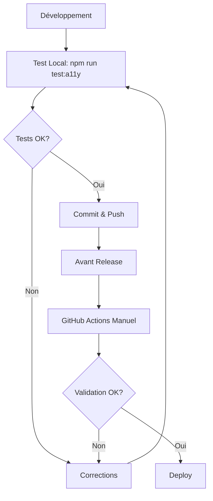

# 🎯 Tests d'Accessibilité - Exécution Manuelle Uniquement

## ⚡ Configuration Optimisée pour GitHub Actions Gratuit

Pour économiser vos minutes GitHub Actions gratuites, les tests d'accessibilité ne s'exécutent **QUE sur demande manuelle**.

## 🚀 Comment Lancer les Tests

### 1. En Local (Recommandé pour le Développement)
```bash
# Tests complets
npm run test:a11y

# Interface graphique interactive
npx playwright test --ui --config=e2e/accessibility.config.ts

# Tests spécifiques
npx playwright test accessibility/wcag-compliance.spec.ts --config=e2e/accessibility.config.ts
```

### 2. Sur GitHub Actions (Manuel)
1. Allez sur **GitHub** → **Actions**
2. Sélectionnez **"Tests d'Accessibilité WCAG"**
3. Cliquez **"Run workflow"**
4. Choisissez vos options :
   - **Navigateur** : chromium, firefox, webkit, ou all
   - **Test spécifique** : (optionnel) nom du fichier
   - **Environnement** : local-build ou production

### 3. Script PowerShell (Windows)
```powershell
# Aide complète
.\run-accessibility-tests.ps1 -Help

# Tests avec interface graphique
.\run-accessibility-tests.ps1 -UI

# Tests spécifiques
.\run-accessibility-tests.ps1 -TestFile wcag-compliance.spec.ts -Browser firefox
```

## 💡 Stratégie d'Utilisation Recommandée

### Développement Quotidien
- **En local** : `npm run test:a11y` avant chaque commit important
- **Interface graphique** : Pour debugging et exploration interactive

### Validation Projet
- **GitHub Actions manuel** : Avant les releases ou jalons importants
- **Multi-navigateurs** : Pour validation complète cross-browser

### CI/CD Pipeline
- **Aucun déclenchement automatique** : Économise vos minutes gratuites
- **Validation manuelle** : Vous contrôlez quand et comment tester

## 📊 Temps d'Exécution Estimés

| Type de Test | Temps Local | Temps GitHub Actions |
|--------------|-------------|---------------------|
| Tests WCAG de base | ~2-3 min | ~4-5 min |
| Tests complets (1 navigateur) | ~5-7 min | ~8-10 min |
| Tests multi-navigateurs | ~15-20 min | ~20-25 min |

## 🎛️ Options GitHub Actions Disponibles

### Navigateurs
- **chromium** (défaut) : Plus rapide, compatible
- **firefox** : Test spécifique Firefox
- **webkit** : Test Safari/WebKit
- **all** : Test complet sur tous les navigateurs

### Tests Spécifiques
- `wcag-compliance.spec.ts` : Tests WCAG généraux (plus rapide)
- `keyboard-navigation.spec.ts` : Navigation clavier uniquement
- `forms-accessibility.spec.ts` : Formulaires uniquement
- *(vide)* : Tous les tests (plus complet)

### Environnements
- **local-build** (défaut) : Build locale pour tests
- **production** : Test sur l'environnement déployé

## 🔄 Workflow Recommandé



## 💰 Économies Réalisées

**Sans configuration manuelle :**
- Tests automatiques sur chaque push/PR
- ~20-25 minutes par exécution
- Potentiellement 100+ exécutions/mois
- = 2000+ minutes utilisées

**Avec configuration manuelle :**
- Tests uniquement quand nécessaire
- Contrôle total du timing
- Estimation : 200-300 minutes/mois maximum

## ⚡ Démarrage Rapide

**Maintenant** :
```bash
cd frontEnd
npm run test:a11y
```

**Pour validation complète** (quand nécessaire) :
1. GitHub → Actions → "Tests d'Accessibilité WCAG" → Run workflow
2. Sélectionner "all" pour les navigateurs
3. Laisser les autres options par défaut

## 📋 Checklist de Validation

- [ ] **Développement** : Tests locaux avant commits importants
- [ ] **Features** : Validation manuelle GitHub Actions pour nouvelles fonctionnalités
- [ ] **Releases** : Tests multi-navigateurs complets
- [ ] **Maintenance** : Tests périodiques (mensuel suggéré)

Vous contrôlez maintenant totalement quand et comment vos tests d'accessibilité s'exécutent ! 🎯
